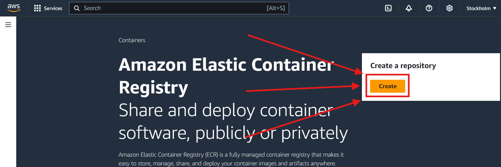
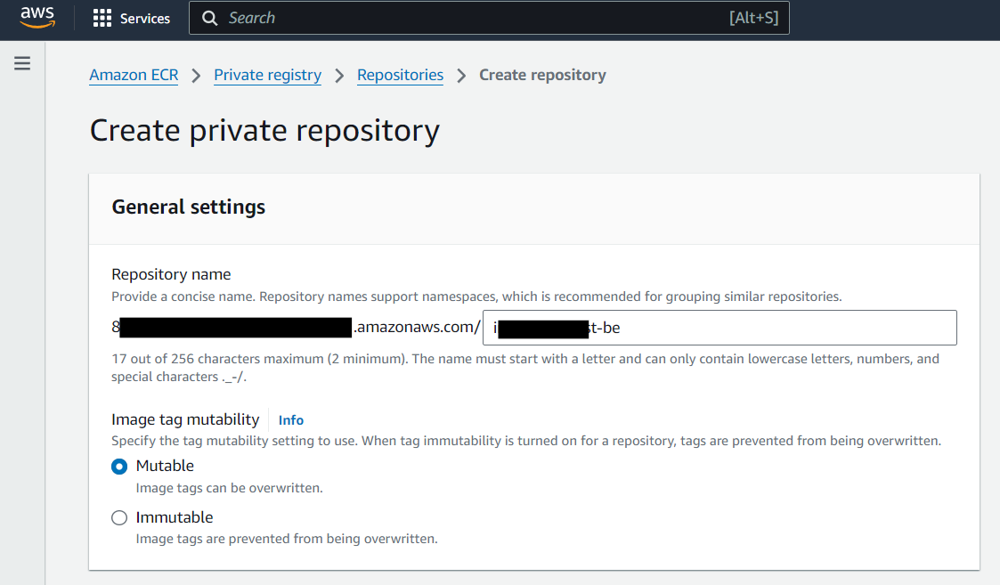
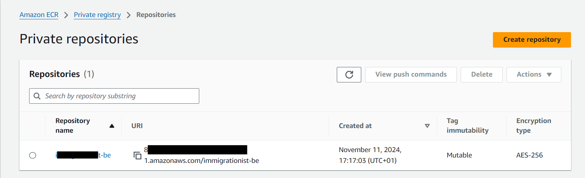

## Create elastic container registry on AWS

1. Go to AWS console and search for ECR:

2. Choose a name for your repository:

> ---
> #### ⚠️**Important note**:
> *A repository relates to one image (image name) and can hold multiple versions (tags) of the same image. For each new image you need a new repository in AWS.*
> *This means what AWS refers to here as "namespace", the docker CLI considers to be the REPO_NAME and what AWS referst to as "repository" is what the docker CLI considers to be the IMAGE_TAG*
> ~ 11.11.2024
> 

Don't change any other settings, once you've pressed the `create` button, you should be redirected to the page listing your repositories:

You can open the repository page by clicking on the repository name link and here you can "View push instructions" to either test your repo through a terminal or copy the instructions to a pipeline to automate your workflow.