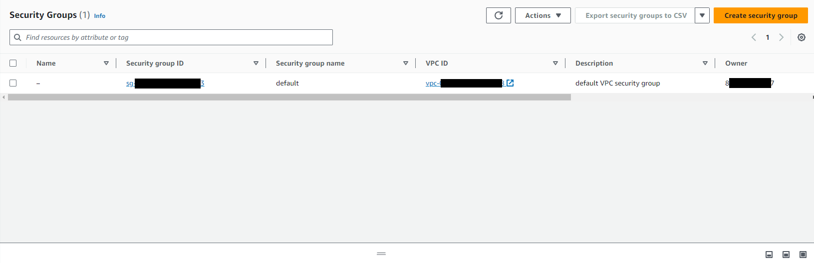
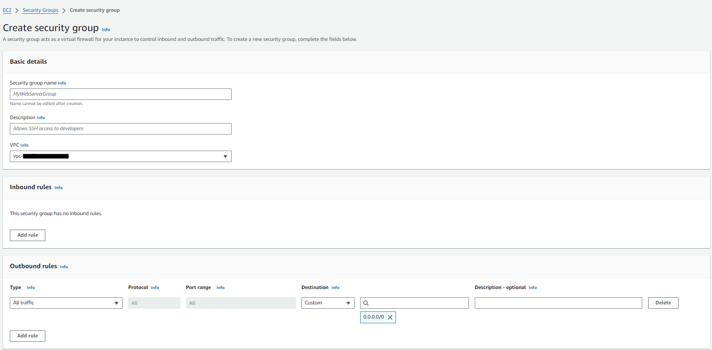

## Create sercurity group on AWS

On AWS console search for "security groups", you can access this page both throug `EC2` and `VPC`

You can create a new one using the "Create security group" button.

Suffix the name with "-sg"

Security grouops allow you to define rules on who can talk to your app. Usually we want to allow everyone to connect to our client-web app, so we can create a rule to allow everyone:

In "Inbound rules" add a new rule
- Type : `HTTP`
- Source : "Anywhere-IPv4"

Outbound should by default allow all trafic.
This means that anybody can access your app through the internet using the `http` protocol and your app can try to initiate any connection towards anybody.