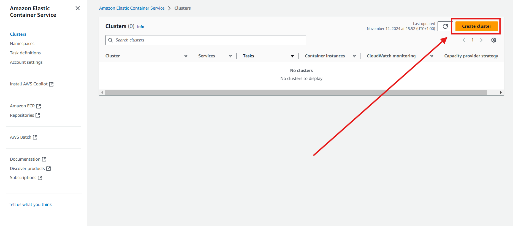
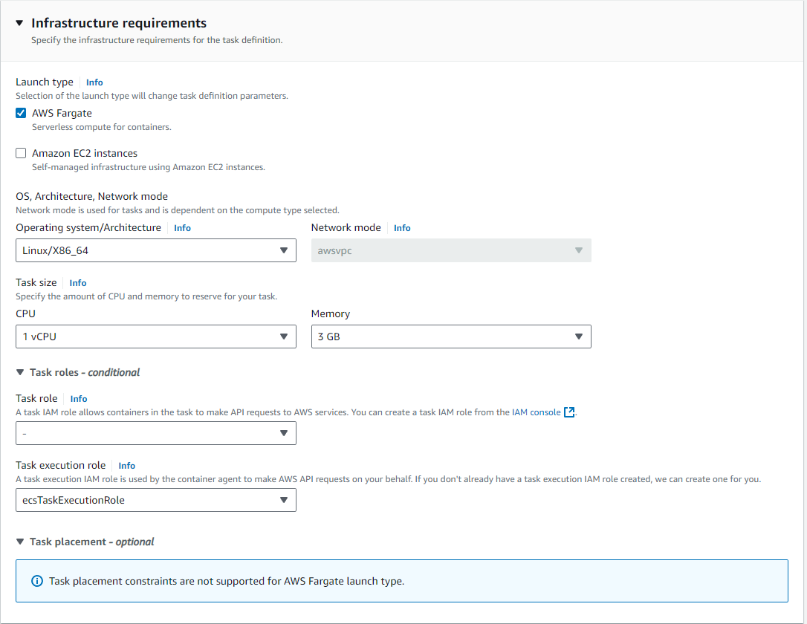
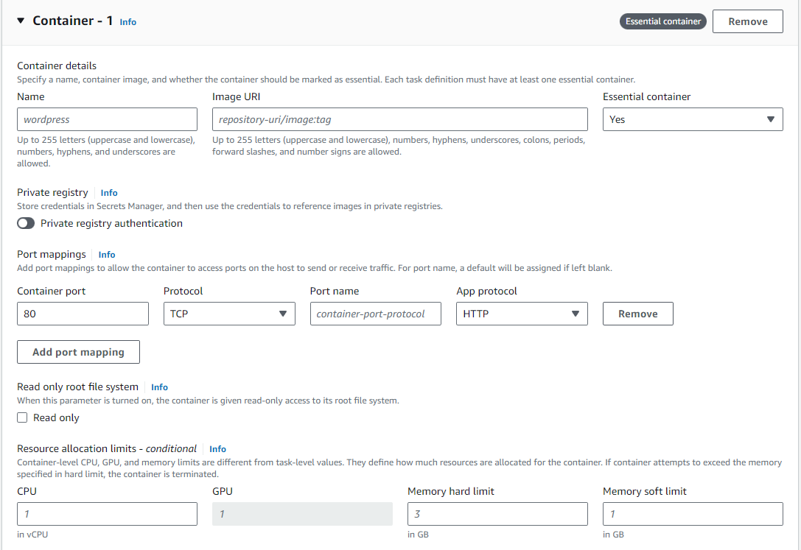
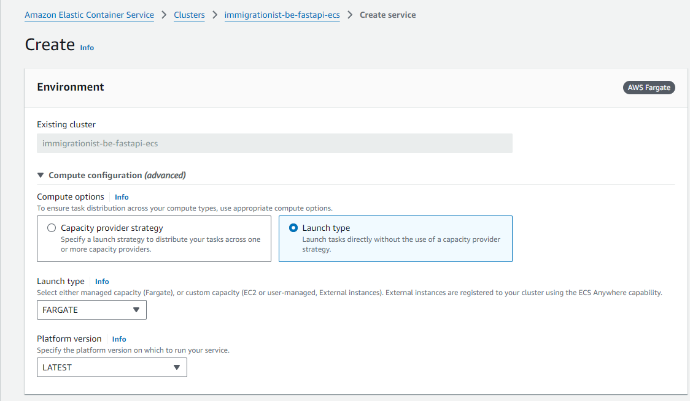
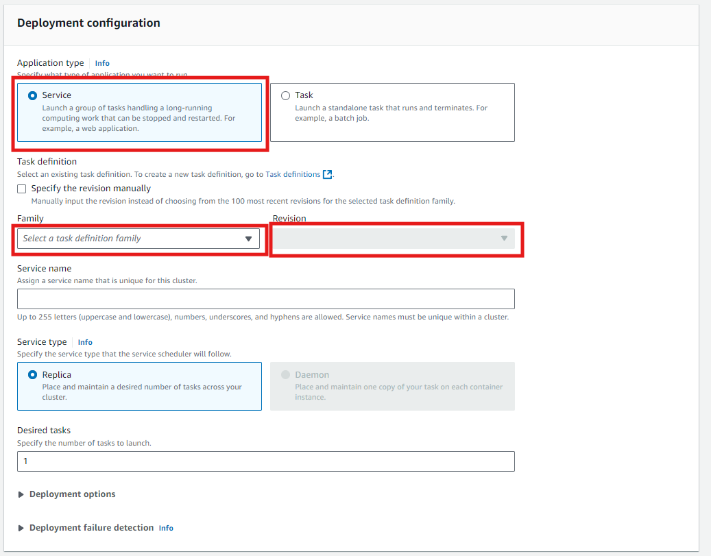
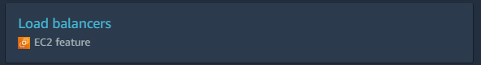

# Deploy to ECS from an ECR

**First** we want to **create 2 security groups**, one to expose our app to the internet and one allow a load balancer to regulate the traffic.

1. [Create a security group](AWS-create-security-group.md) for our application load balancer opening inbound traffic to everybody through `http`. Add a suffix `alb-sg` to differentiate it.

| IP version | Type | Protocol | Port range |  Source   |
|:----------:|:----:|:--------:|:----------:|:---------:|
|    IPv4    | HTTP |   TCP    |     80     | 0.0.0.0/0 |

2. Create a security group for the application, it should have an inbound rule which allows the previous security group access:

| IP version |    Type    | Protocol |     Port range     |     Source      |
|:----------:|:----------:|:--------:|:------------------:|:---------------:|
|     –      | Custom TCP |   TCP    | `<your-apps-port>` | `<your-alb-sg>` |

**Next** we can create the ECS Fargate cluster.
A cluster will hold all of our containers.

Search for "ECS" (Elastic Container Service), you should land on this page:

Give it a name with the "-ecs" suffix and choose Fargate (Serverless). Click "Create", this might take a few moments.
You should be notified once it is complete:
`✅Cluster your-cluster-name-ecs has been created successfully.`
It should also apear in the cluster list below.

**Next** we need to create a Task definition.
The task definition defines how we are going to spin up a container for our image.

On the same page in the left side-bar menu, open the `Task definitions` page and create a new one.

You can name your Task definition, AWS calls it the `Task definition family name`, essentially you can have multiple revisions for each task definition. 

You can also define the infrastructure requirements of your app here.

You will need to define your task with at least one container. 

Give the container a name and copy the previously created repository URI, make sure to add the image tag, i.e. `:latest`
You should also define the port mappings:
- `Container Port` : `<port-number-your-app-serves>`
- `Protocol` : `TCP`
- `App protocol` : `HTTP`

Now we have a cluster to hold containers and a task definitions for the containers to launch, all we are missing is services that will run these containers.

Navigate to your cluster and click on "Create Service" 

Make sure to select `Launch type`

In the `Deployment configuration` section specify a name for the service

Make sure to select the family name of the previously created task definition and select the latest revision. We are choosing `Service` because we want it to keep running.

In the `Networking` section remove the default security group and select the previously created securtiy group under number 1 at the beginning of this page.

Next to move the the `Load balancer` section and from the dropdown manu choose `Application Load Balancer` 
Give it a name and set the `Health check grace period` to something reasonable like 120 seconds.
Make sure to specify the `Health check path`, your app should have a GET endpoint that returns `Status Code 200` whenever the service is running.

**Next** search for "load balancers"

Click on the load balancer you just created and navigate to the `Actions` dropdown menu and select
`Edit security groups`
On this page remove the security group that was automatically assigned and add the one we created for the load balancer under number 2. at the beginning of this page.