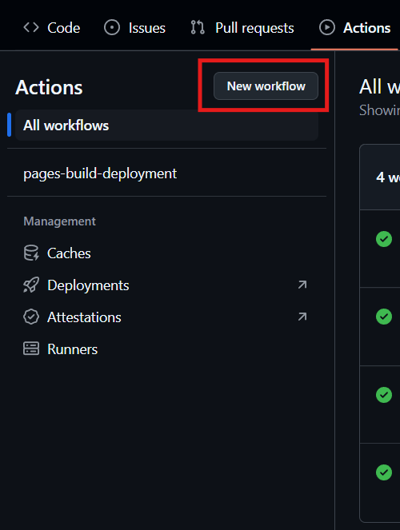
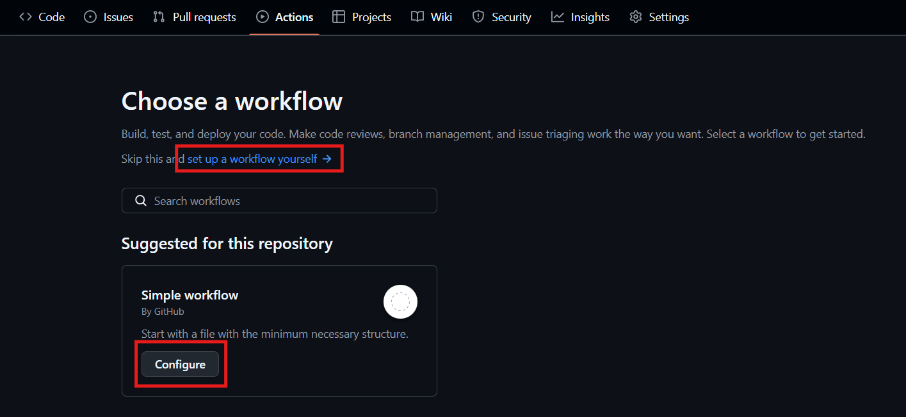
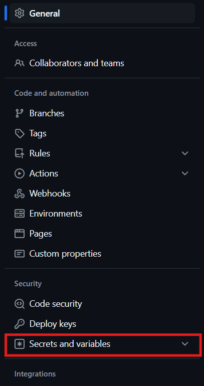

# Github actions

To create/edit Github Actions go to the `Actions` tab in you repository:


Create new workflow in the top left of the `Actions` page:



Here you can choose a template, we can go either from scratch use the "Simple workflow" template:



Follow platform specific instuctions bellow..

## AWS

Before we can push the docker image, we need to create a repository! Follow instructions [here](/AWS-create-ECR.md)!

Once we have a working repository and `Dockerfile` we can create our github action to build and push the image:

```yaml
name: CI/CD Pipeline

on:
  push:
    branches:
      - main
jobs:
  build-and-push:
    runs-on: ubuntu-latest
    env:
      AWS_REGION: eu-north-1 # AWS region
      IMAGE_NAME: api
      IMAGE_TAG: latest
    steps:
      - name: Checkout code
        uses: actions/checkout@v4

      - name: Configure AWS credentials
        uses: aws-actions/configure-aws-credentials@v4
        with:
          aws-access-key-id: ${{ secrets.AWS_ACCESS_KEY_ID }}
          aws-secret-access-key: ${{ secrets.AWS_SECRET_ACCESS_KEY }}

      - name: Log in to Amazon ECR
        uses: aws-actions/amazon-ecr-login@v2
        with:
          region: ${{ env.AWS_REGION }}

      - name: Build Docker image
        run: docker build . --tag ${{ vars.ECR_REGISTRY }}/${{ vars.REPO_NAME }}/${{ env.IMAGE_NAME }}:${{ env.IMAGE_TAG }}

      - name: Push Docker image to Amazon ECR
        run: docker push ${{ vars.ECR_REGISTRY }}/${{ vars.REPO_NAME }}/${{ env.IMAGE_NAME }}:${{ env.IMAGE_TAG }}
```
### Breakdown
1. Choose [`push event type`](https://docs.github.com/en/actions/writing-workflows/choosing-when-your-workflow-runs/events-that-trigger-workflows#push) and branches to watch:
```yaml
on:
  push:
    branches:
      - main
```
2. Configure AWS credentials:
```yaml
steps:
   - name: Configure AWS credentials
     uses: aws-actions/configure-aws-credentials@v3
     with:
       aws-access-key-id: ${{ secrets.AWS_ACCESS_KEY_ID }}
       aws-secret-access-key: ${{ secrets.AWS_SECRET_ACCESS_KEY }}
```
Generate new access key in AWS console:
1. Go to AWS Management Console.
2. Go to **IAM** -> **Users** -> **Create user** or use existing
3. **Add access key**
4. Copy **Access key ID** and **Secret access key**

Create 2 new secrets: `AWS_ACCESS_KEY_ID` and   `AWS_SECRET_ACCESS_KEY`

Add secrets:



Secrets and variables -> Actions
These will be accessible in any workflow as `${{ secrets.AWS_ACCESS_KEY_ID }}` and `${{ secrets.AWS_SECRET_ACCESS_KEY }}`

!* Side note: Repository variables are available in workflow as `${{ vars.SOME_VARIABLE }}`

3. Log in to Amazon ECR:
```yaml
steps:
   - name: Log in to Amazon ECR
     uses: aws-actions/amazon-ecr-login@v1
     with:
      region: ${{ env.AWS_REGION }}
```
This will use the AWS credentials from above and log in to Amazon ECR